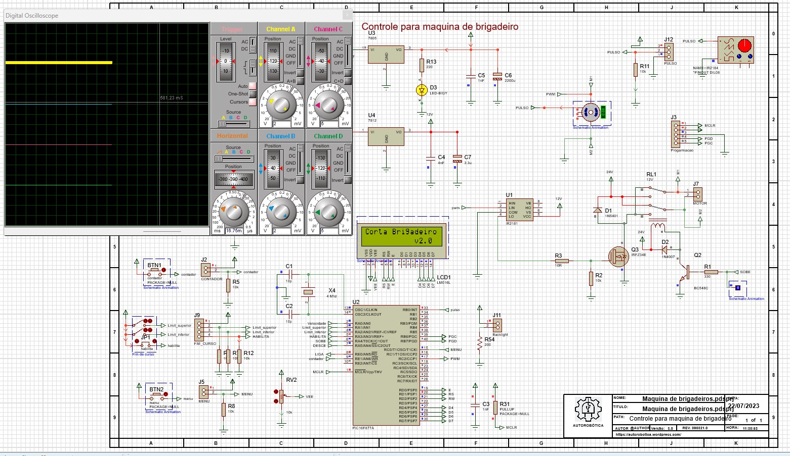
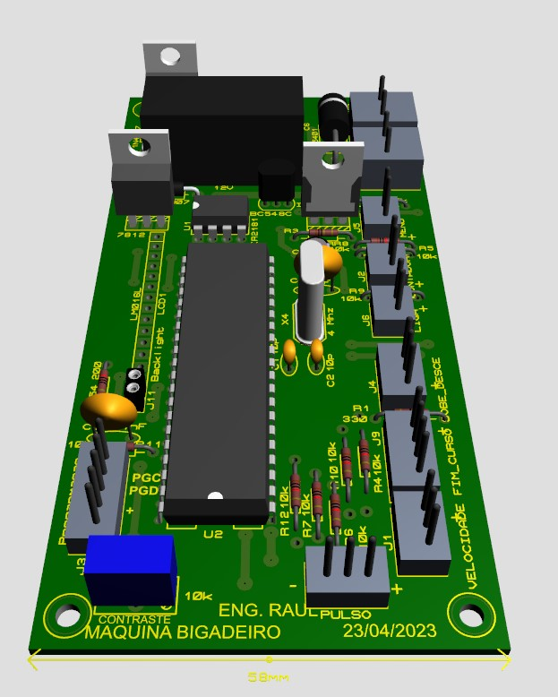
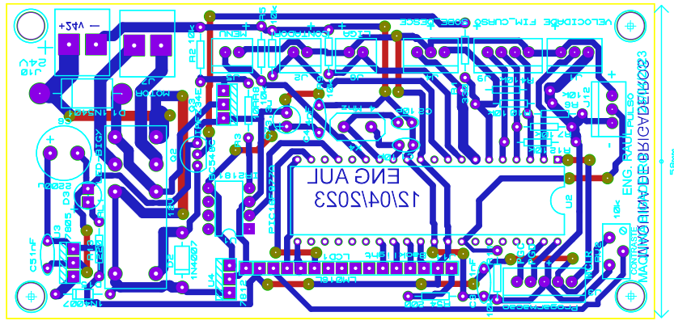
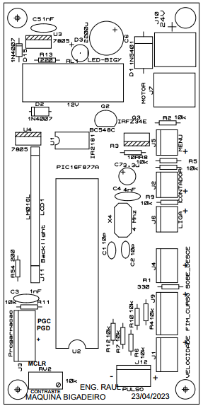
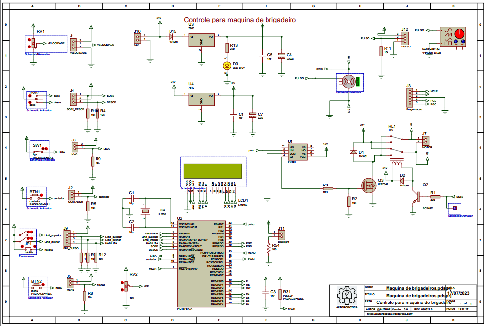

# Máquina de Brigadeiro com Controle de Peso

Projeto de automação para adaptação de uma máquina de fabricação de salgados e doces, com foco na produção automatizada de brigadeiros padronizados por peso.

O sistema foi desenvolvido para realizar a dosagem precisa da massa, permitindo controlar individualmente o peso de cada brigadeiro, aumentando a padronização, produtividade e reduzindo desperdícios no processo de fabricação.

---

# Vídeo do Projeto

Vídeo demonstrando o funcionamento do protótipo:

https://youtu.be/tlVxIcxrgFs?si=QzBE4BBvu3v554gS

---

# Principais Recursos

- Controle automático da dosagem
- Padronização do peso dos brigadeiros
- Sistema embarcado dedicado
- Interface eletrônica de controle
- Ajuste fino de parâmetros de produção
- Projeto mecânico e eletrônico integrado

---

# Hardware Utilizado

- Microcontrolador PIC18F887
- Circuito eletrônico desenvolvido em PCI
- Sensores e atuadores para controle do processo
- Sistema de acionamento da máquina adaptada

---

# Firmware

O firmware foi desenvolvido em linguagem C utilizando a IDE CCS Compiler, responsável por:

- Controle do processo de dosagem
- Leitura de sensores
- Controle de motores e atuadores
- Ajuste e monitoramento do peso
- Automação do ciclo de produção

---

# Estrutura do Projeto

O repositório contém:

- Firmware completo em C
- Diagramas esquemáticos
- Projeto eletrônico da PCI
- Layout da placa
- Footprints utilizados
- Vídeos de testes e ajustes
- Documentação do projeto

---

# Simulação do Projeto

Imagem da simulação eletrônica do sistema:

---

# Placa Desenvolvida

Imagem da placa PCI utilizada no projeto:

---

# Layout da PCI

Layout da placa de circuito impresso:

---

# Footprints Utilizados

Footprints utilizados no desenvolvimento da PCI:

---

# Diagrama Elétrico

Diagrama esquemático do circuito eletrônico:

---

# Vídeos de Funcionamento

## Teste de Redução

Vídeo demonstrando o sistema de redução e acionamento:

<video src="Videos/Teste de redução.mp4" controls width="700"></video>

---

## Ajustes do Sistema

Vídeo demonstrando ajustes e calibração do equipamento:

<video src="Videos/Ajustes.mp4" controls width="700"></video>

---

# Objetivo

Demonstrar uma solução de automação embarcada aplicada à indústria alimentícia artesanal, utilizando controle eletrônico para garantir maior precisão e repetibilidade na produção de brigadeiros.

---

# Tecnologias Utilizadas

- Linguagem C
- CCS C Compiler
- Microcontrolador PIC18F887
- Eletrônica embarcada
- Automação industrial

---

# Autor

Projeto desenvolvido por Raul Star.
